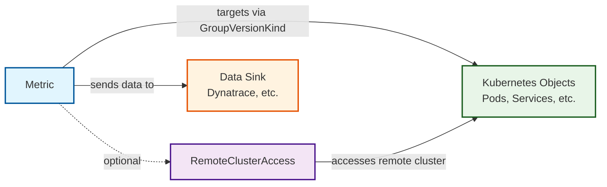
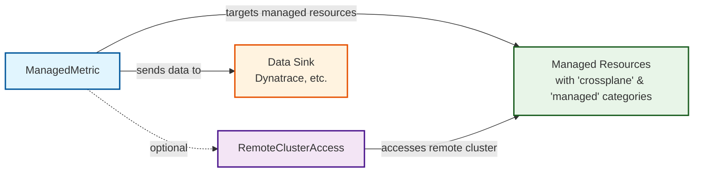
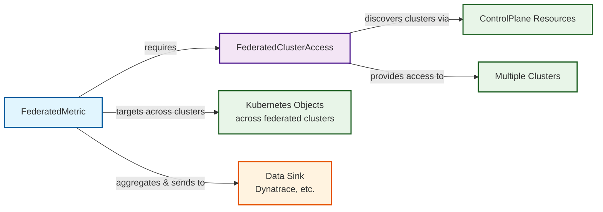
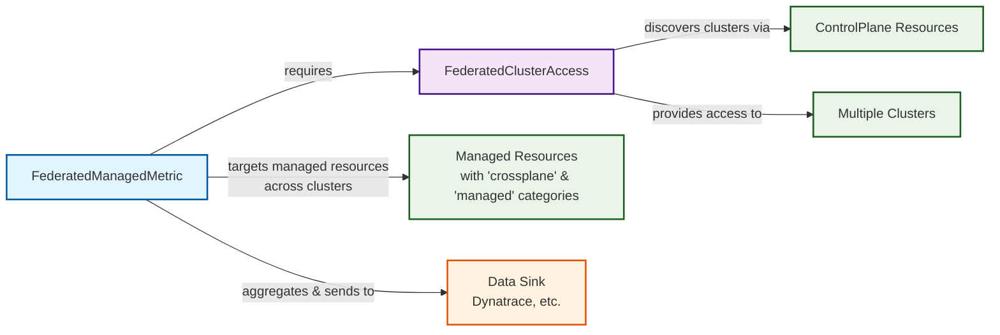

[](https://api.reuse.software/info/github.com/openmcp-project/metrics-operator)

# Metrics Operator

The Metrics Operator is a powerful tool designed to monitor and provide insights into the state, usage, patterns, and trends of distributed systems and their associated components.

## Table of Contents

- [Metrics Operator](#metrics-operator)
  - [Table of Contents](#table-of-contents)
  - [Key Features](#key-features)
  - [Architecture Overview](#architecture-overview)
    - [Metric Resource Flow](#metric-resource-flow)
    - [ManagedMetric Resource Flow](#managedmetric-resource-flow)
    - [FederatedMetric Resource Flow](#federatedmetric-resource-flow)
    - [FederatedManagedMetric Resource Flow](#federatedmanagedmetric-resource-flow)
  - [Resource Type Descriptions:](#resource-type-descriptions)
  - [Installation](#installation)
    - [Prerequisites](#prerequisites)
    - [Deployment](#deployment)
  - [Getting Started](#getting-started)
    - [Quickstart](#quickstart)
    - [Common Development Tasks](#common-development-tasks)
  - [Usage](#usage)
    - [Metric](#metric)
    - [Managed Metric](#managed-metric)
    - [Federated Metric](#federated-metric)
    - [Federated Managed Metric](#federated-managed-metric)
  - [Remote Cluster Access](#remote-cluster-access)
    - [Remote Cluster Access](#remote-cluster-access-1)
    - [Federated Cluster Access](#federated-cluster-access)
  - [RBAC Configuration](#rbac-configuration)
  - [DataSink Configuration](#datasink-configuration)
    - [Creating a DataSink](#creating-a-datasink)
    - [DataSink Specification](#datasink-specification)
      - [Connection](#connection)
      - [Authentication](#authentication)
    - [Using DataSink in Metrics](#using-datasink-in-metrics)
    - [Default Behavior](#default-behavior)
    - [Supported Metric Types](#supported-metric-types)
    - [Examples and Detailed Documentation](#examples-and-detailed-documentation)
    - [Migration from Legacy Configuration](#migration-from-legacy-configuration)
  - [Data Sink Integration](#data-sink-integration)
  - [Support, Feedback, Contributing](#support-feedback-contributing)
  - [Security / Disclosure](#security--disclosure)
  - [Code of Conduct](#code-of-conduct)
  - [Licensing](#licensing)

## Key Features

- **Comprehensive Resource Tracking**: Quantifies and catalogs various resource types, providing a holistic view of resource distribution and utilization.
- **Multi-dimensional Analysis**: Examines specific attributes and dimensions of resources, generating nuanced metrics for deeper understanding of system behavior.
- **Comparative Analytics**: Enables side-by-side analysis of different resource configurations, highlighting patterns and potential imbalances in resource allocation.
- **Custom Component Focus**: Tailored to monitor and analyze complex, custom-defined resources across your infrastructure.
- **Predictive Insights**: Aggregates data over time to identify emerging trends, supporting data-driven decision making for future system enhancements.
- **Strategic Decision Support**: Offers data-backed insights to guide product evolution.
- **Customizable Alerting System**: Allows defining alerts based on specific metric thresholds, enabling proactive response to potential issues or significant changes in system state.
- **Standardized**: Exports all metrics using the [OpenTelemetry](https://opentelemetry.io) protocol for seamless observability and interoperability.

## Architecture Overview

The Metrics Operator provides four main resource types for monitoring Kubernetes objects. Each type serves different use cases:

### Metric Resource Flow



### ManagedMetric Resource Flow



### FederatedMetric Resource Flow



### FederatedManagedMetric Resource Flow



## Resource Type Descriptions:

- [**Metric**](cmd/metrics-operator/embedded/crds/metrics.openmcp.cloud_metrics.yaml): Monitors specific Kubernetes resources in the local or remote clusters using GroupVersionKind targeting
- [**ManagedMetric**](cmd/metrics-operator/embedded/crds/metrics.openmcp.cloud_managedmetrics.yaml): Specialized for monitoring Crossplane managed resources (resources with "crossplane" and "managed" categories)
- [**FederatedMetric**](cmd/metrics-operator/embedded/crds/metrics.openmcp.cloud_federatedmetrics.yaml): Monitors resources across multiple clusters, aggregating data from federated sources
- [**FederatedManagedMetric**](cmd/metrics-operator/embedded/crds/metrics.openmcp.cloud_federatedmanagedmetrics.yaml): Monitors Crossplane managed resources across multiple clusters
- [**RemoteClusterAccess**](cmd/metrics-operator/embedded/crds/metrics.openmcp.cloud_remoteclusteraccesses.yaml): Provides access configuration for monitoring resources in remote clusters
- [**FederatedClusterAccess**](cmd/metrics-operator/embedded/crds/metrics.openmcp.cloud_federatedclusteraccesses.yaml): Discovers and provides access to multiple clusters for federated monitoring
- [**DataSink**](cmd/metrics-operator/embedded/crds/metrics.openmcp.cloud_datasinks.yaml): Defines where and how metrics data should be sent, supporting various destinations like Dynatrace

## Installation

### Prerequisites

1. Create a namespace for the Metrics Operator.
2. Create a DataSink resource and associated authentication secret for your metrics destination.

### Deployment

Deploy the Metrics Operator using the Helm chart:

```bash
helm upgrade --install metrics-operator oci://ghcr.io/openmcp-project/charts/metrics-operator \
  --namespace <operator-namespace> \
  --create-namespace \
  --version=<version>
```

Replace `<operator-namespace>` and `<version>` with appropriate values.

After deployment, create your DataSink configuration as described in the [DataSink Configuration](#datasink-configuration) section.

## Getting Started
You’ll need a Kubernetes cluster to run against. You can use [KIND](https://sigs.k8s.io/kind) to get a local cluster for testing, or run against a remote cluster.
**Note:** Your controller will automatically use the current context in your kubeconfig file (i.e. whatever cluster `kubectl cluster-info` shows).

### Quickstart

This project uses [Taskfile](https://taskfile.dev/) to streamline development activities. Most of the common targets are shared among other OpenMCP components using a shared [build](https://github.com/openmcp-project/build/) repository. The build repository is included as a git submodule.

This will ensure the submodule is pulled and updated to latest included revision. Some of the common tasks supported are:
1. Clone the repository and install prerequisites (Go, Docker, kind, kubectl, task).
2. Ensure the build submodule is initialized and updated:
```bash
git submodule update --init
```
3. Configure your data sink by copying the configuration in [`examples/datasink/basic-datasink.yaml`](examples/datasink/basic-datasink.yaml) and modifying it to suit your environment.
   - For example, if using Dynatrace, create a Kubernetes Secret with your API token and update the DataSink resource accordingly.
   - The file should be placed and named like this: `examples/datasink/dynatrace-prod-setup.yaml`. (automatically excluded in [.gitignore](.gitignore))
4. Run `task dev:local:all` to set up a local development environment.
5. Run `task run` to start the Metrics Operator locally.
6. Check your data sink for incoming metrics.

### Common Development Tasks
To get a full list of the supported tasks, you can run the `task` command with no arguments. However, the most commonly used tasks are:

- `task dev:local:all` – Set up a local kind cluster with all CRDs, Crossplane, and sample resources.
- `task run` – Run the operator locally for development.
- `task dev:clean` – Delete the local kind cluster.
- `task test` – Run all Go tests.
- `task generate` – Regenerate CRDs and deepcopy code after API changes.
- `task validate:lint` – Run golangci-lint on the codebase.

## Usage

### Metric

Metrics have additional capabilities, such as dimensions. Dimensions allow you to extract additional data from the target resource, such as fields, labels, or annotations.
See the [dimensions documentation](docs/dimensions-configuration.md) for a comprehensive usage overview.

```yaml
apiVersion: metrics.openmcp.cloud/v1alpha1
kind: Metric
metadata:
  name: metric-pod-count
spec:
  name: metric-pod-count
  description: Pods
  target:
    kind: Pod
    group: ""
    version: v1
  interval: "1m"
  projections:
    - name: pod-namespace
      fieldPath: "metadata.namespace"
---
```

### Managed Metric

Managed metrics are used to monitor Crossplane managed resources. They automatically track resources that have the "crossplane" and "managed" categories in their CRDs. By default, they export dimensions based on `status.conditions`. Custom Dimensions are also supported. See the [dimensions documentation](docs/dimensions-configuration.md) for a comprehensive usage overview.

```yaml
apiVersion: metrics.openmcp.cloud/v1alpha1
kind: ManagedMetric
metadata:
  name: managed-metric
spec:
  name: managed-metric
  description: Status metric created by an Operator
  target:
    kind: Release
    group: helm.crossplane.io
    version: v1beta1
  interval: "1m"
---
```

### Federated Metric
Federated metrics deal with resources that are spread across multiple clusters. To monitor these resources, you need to define a `FederatedMetric` resource.
They offer capabilities to aggregate data as well as filtering down to a specific cluster or field using projections.
```yaml
apiVersion: metrics.openmcp.cloud/v1alpha1
kind: FederatedMetric
metadata:
  name: xfed-prov
spec:
  name: xfed-prov
  description: crossplane providers
  target:
    kind: Provider
    group: pkg.crossplane.io
    version: v1
  interval: "1m"
  projections:
    - name: package
      fieldPath: "spec.package"
  federateClusterAccessRef:
    name: federate-ca-sample
    namespace: default
---

```

### Federated Managed Metric
This is a special use case metric, it is looking at all the crossplane managed resource across all clusters.
The pre-condition here is that if a resource comes from a crossplane provider, its CRD should have categories "crossplane" and "managed".


```yaml
apiVersion: metrics.openmcp.cloud/v1alpha1
kind: FederatedManagedMetric
metadata:
  name: xfed-managed
spec:
  name: xfed-managed
  description: crossplane managed resources
  interval: "1m"
  federateClusterAccessRef:
    name: federate-ca-sample
    namespace: default
---
```

### Default Values

Projections are supporting default values. This means that if the field specified in the `fieldPath` is not present in the target resource, the projection will use the provided `defaultValue` instead. 
This ensures that your metrics can still be generated even if some resources are missing certain fields.
The type of the `defaultValue` must match the type of the field specified in the `fieldPath`.
Attention, if `fieldType` is not specified, the default type is `primitive` and the `defaultValue` will be treated as a string. 
This can lead to issues if the field specified in the `fieldPath` is of a different type (map or slice). Therefore, it is recommended to always specify the `fieldType` when using default values.

```yaml
apiVersion: metrics.openmcp.cloud/v1alpha1
kind: Metric
metadata:
  name: metric-condition-healthy
spec:
  name: metric-condition-healthy
  description: Healthy Kustomizations
  target:
    kind: TypeWithConditions
    group: example.group
    version: v1
  interval: "1m"
  projections:
    - name: pod-namespace
      fieldPath: "status.conditions[?(@.type=='Healthy')].status"
      fieldType: "primitive"
      defaultValue: "unknown"
---
```

## Remote Cluster Access


### Remote Cluster Access

The Metrics Operator can monitor both the cluster it's deployed in and remote clusters. To monitor a remote cluster, define a `RemoteClusterAccess` resource:

This remote cluster access resource can be used by `Metric` and `ManagedMetric` resources to monitor resources in the remote cluster.

You can configure access to a remote cluster in one of two ways:

1. Access via Service Account Token (recommended for in-cluster or service mesh setups)

Use this method if you want the operator to assume a service account in the remote cluster using projected tokens and cluster credentials. This allows for dynamic access for clusters using an OIDC provider.

```yaml
apiVersion: metrics.openmcp.cloud/v1alpha1
kind: RemoteClusterAccess
metadata:
  name: remote-cluster
  namespace: <monitoring-namespace>
spec:
  remoteClusterConfig:
    clusterSecretRef:
      name: remote-cluster-secret
      namespace: <secret-namespace>
    serviceAccountName: <service-account-name>
    serviceAccountNamespace: <service-account-namespace>
```
`clusterSecretRef` must point to a Kubernetes Secret on the same cluster running `the metrics-operator` and contains:
- `host`: API server endpoint of the remote cluster 
- `caData`: CA bundle of the remote cluster API (base64-encoded) 
- `audience`: Token audience to use when projecting the service account token

You will also need to setup the required [RBAC configuration](#rbac-configuration) for the service account on the remote clusters. The RBAC configuration should allow the service account to monitor the resources defined in your `Metric` resources and use the proper service account name for remote access.

2. Access via Kubeconfig Secret
Use this method if you already have a kubeconfig for the remote cluster and want to provide it directly.

```yaml
apiVersion: metrics.openmcp.cloud/v1alpha1
kind: RemoteClusterAccess
metadata:
  name: remote-cluster
  namespace: <monitoring-namespace>
spec:
  kubeConfigSecretRef:
    name: remote-kubeconfig-secret
    namespace: <secret-namespace>
    key: kubeconfig
```
`kubeConfigSecretRef` points to a Kubernetes Secret that includes a valid kubeconfig under the specified `key`.

### Federated Cluster Access

To monitor resources across multiple clusters, define a `FederatedClusterAccess` resource.
The `target` field specifies the type of resource used to discover clusters.
The `kubeConfigPath` field indicates where to find the kubeconfig for each cluster, relative to the discovered resource.
The type of field that is selected with `kubeConfigPath` can be a string or object.

```yaml
apiVersion: metrics.openmcp.cloud/v1alpha1
kind: FederatedClusterAccess
metadata:
  name: federate-ca-sample
  namespace: default
spec:
  target:
    kind: ControlPlane
    group: core.orchestrate.cloud.sap
    version: v1beta1
  kubeConfigPath: spec.target.kubeconfig
```

Instead of `kubeConfigPath`, you can also use `kubeConfigSecretPath` to specify the path to a secret reference that contains the kubeconfig.
The type of field that is selected with `kubeConfigSecretPath` must be an object of type `SecretReference` that contains the name and namespace of the secret as well as the name the key of the kubeconfig.
If the `namespace` field is omitted, it defaults to the namespace of the discovered resource.
If the `key` field is omitted, it defaults to `kubeconfig`.

```yaml
apiVersion: metrics.openmcp.cloud/v1alpha1
kind: FederatedClusterAccess
metadata:
  name: federate-ar-sample
  namespace: default
spec:
  target:
    kind: AccessRequest
    group: clusters.openmcp.cloud
    version: v1alpha1
  secretRefPath: status.secretRef
---
apiVersion: clusters.openmcp.cloud/v1alpha1
kind: AccessRequest
metadata:
  name: example-access-request
  namespace: default
spec: {}
status:
  secretRef:
    name: example-access-request.kubeconfig
```

The targets in the `FederatedClusterAccess` resource can be further filtered using label selectors and field selectors as well as namespace scoping.
Namespace scoping can only be applied if the target resource is namespaced.

```yaml
apiVersion: metrics.openmcp.cloud/v1alpha1
kind: FederatedClusterAccess
metadata:
    name: federate-ca-filtered
    namespace: default
spec:
    target:
      kind: ControlPlane
      group: core.orchestrate.cloud.sap
      version: v1beta1
    namespace: co-system
    labelSelector: "environment=production"
    fieldSelector: "spec.region=us-west"
    kubeConfigPath: spec.target.kubeconfig
```

## RBAC Configuration

The Metrics Operator requires appropriate permissions to monitor the resources you specify. You need to configure RBAC (Role-Based Access Control) to grant these permissions. Here's an example of how to create a ClusterRole and ClusterRoleBinding for the Metrics Operator:

```yaml
---
apiVersion: rbac.authorization.k8s.io/v1
kind: ClusterRole
metadata:
  name: metrics-operator-role
rules:
- apiGroups:
  - "example.group"
  resources:
  - "exampleresources"
  verbs:
  - get
  - list
  - watch
---
apiVersion: rbac.authorization.k8s.io/v1
kind: ClusterRoleBinding
metadata:
  name: metrics-operator-rolebinding
subjects:
- kind: ServiceAccount
  name: metrics-operator-sa
  namespace: <operator-namespace>
roleRef:
  kind: ClusterRole
  name: metrics-operator-role
  apiGroup: rbac.authorization.k8s.io
```

Replace `<operator-namespace>` with the namespace where the Metrics Operator is deployed. Adjust the `apiGroups` and `resources` fields to match the resources you want to monitor.

Apply the RBAC configuration:

```bash
kubectl apply -f rbac-config.yaml
```

Remember to update this RBAC configuration whenever you add new resource types to monitor.


## DataSink Configuration

The Metrics Operator uses DataSink custom resources to define where and how metrics data should be sent. This provides a flexible and secure way to configure data destinations.

### Creating a DataSink

Define a DataSink resource to specify the connection details and authentication for your metrics destination:
DataSink currently supports HTTP(s) and gRPC(s) endpoints.
The supported protocols are:

* `http://` and `https://` for HTTP(S) endpoints
* `grpc://` and `grpcs://` for gRPC(S) endpoints

#### API Key Authentication

DataSink supports API key authentication using Kubernetes Secrets. Below is an example of a DataSink configuration for sending metrics to Dynatrace:

```yaml
apiVersion: metrics.openmcp.cloud/v1alpha1
kind: DataSink
metadata:
  name: default
  namespace: metrics-operator-system
spec:
  connection:
    endpoint: "https://your-tenant.live.dynatrace.com/api/v2/otlp/v1/metrics"
  authentication:
    apiKey:
      secretKeyRef:
        name: dynatrace-credentials
        key: api-token
```

#### mTLS Certificate Authentication

DataSink also supports mTLS certificate authentication using Kubernetes Secrets. Below is an example of a DataSink configuration for sending metrics to a gRPC endpoint with mTLS:

```yaml
apiVersion: metrics.openmcp.cloud/v1alpha1
kind: DataSink
metadata:
  name: mtls-datasink
  namespace: metrics-operator-system
spec:
  connection:
    endpoint: "grpcs://your-secure-endpoint.com:443"
  authentication:
    certificate:
      clientCertSecretKeyRef:
        name: opensearch-tls-creds
        key: client-cert
      clientKeySecretKeyRef:
        name: opensearch-tls-creds
        key: client-key
      caCertSecretKeyRef:
        name: opensearch-tls-creds
        key: ca-cert
```

### DataSink Specification

The `DataSinkSpec` contains the following fields:

#### Connection
- **endpoint**: The target endpoint URL where metrics will be sent

#### Authentication
- **apiKey**: API key authentication configuration
  - **secretKeyRef**: Reference to a Kubernetes Secret containing the API key
    - **name**: Name of the Secret
    - **key**: Key within the Secret containing the API token
- **certificate**: mTLS certificate authentication configuration
  - **clientCertSecretKeyRef**: Reference to a Kubernetes Secret containing the client certificate
    - **name**: Name of the Secret
    - **key**: Key within the Secret containing the client certificate
  - **clientKeySecretKeyRef**: Reference to a Kubernetes Secret containing the client private key
    - **name**: Name of the Secret
    - **key**: Key within the Secret containing the client private key
  - **caCertSecretKeyRef**: Reference to a Kubernetes Secret containing the CA certificate
    - **name**: Name of the Secret
    - **key**: Key within the Secret containing the CA certificate

### Using DataSink in Metrics

All metric types support the `dataSinkRef` field to specify which DataSink to use:

```yaml
apiVersion: metrics.openmcp.cloud/v1alpha1
kind: Metric
metadata:
  name: pod-count
spec:
  name: "pods.count"
  target:
    kind: Pod
    group: ""
    version: v1
  dataSinkRef:
    name: default  # References the DataSink named "default"
```

### Default Behavior

If no `dataSinkRef` is specified in a metric resource, the operator will automatically use a DataSink named "default" in the operator's namespace. This provides backward compatibility and simplifies configuration for single data sink deployments.

### Supported Metric Types

The `dataSinkRef` field is available in all metric resource types:

- [`Metric`](#metric): Basic metrics for Kubernetes resources
- [`ManagedMetric`](#managed-metric): Metrics for Crossplane managed resources
- [`FederatedMetric`](#federated-metric): Metrics across multiple clusters
- [`FederatedManagedMetric`](#federated-managed-metric): Managed resource metrics across multiple clusters

### Examples and Detailed Documentation

For complete examples and more detailed configuration options:

- See the [`examples/datasink/`](examples/datasink/) directory for practical examples
- Read the comprehensive [DataSink Configuration Guide](docs/datasink-configuration.md) for detailed documentation

The examples directory contains:
- Basic DataSink configuration examples
- Examples showing DataSink usage with different metric types
- Migration guidance from legacy configurations

The detailed guide covers:
- Complete specification reference
- Multiple DataSink scenarios
- Advanced configuration options
- Troubleshooting and best practices

### Migration from Legacy Configuration

**Important**: The old method of using hardcoded secret names (such as `dynatrace-credentials`) has been deprecated and removed. You must now use DataSink resources to configure your metrics destinations.

To migrate:
1. Create a DataSink resource pointing to your existing authentication secret
2. Update your metric resources to reference the DataSink using `dataSinkRef`
3. Remove any hardcoded secret references from your configuration

## Data Sink Integration

The Metrics Operator sends collected data to configured data sinks for storage and analysis. Data sinks (e.g., Dynatrace) provide tools for data aggregation, filtering, and visualization.

To make the most of your metrics:

1. Configure your DataSink resources according to your data sink's documentation.
2. Use the data sink's query language or UI to create custom views of your metrics.
3. Set up alerts based on metric thresholds or patterns.
4. Leverage the data sink's analysis tools to gain insights into your system's behavior and performance.

For specific instructions on using your data sink's features, refer to its documentation. For example, if using Dynatrace, consult the Dynatrace documentation for information on creating custom charts, setting up alerts, and performing advanced analytics on your metric data.


## Support, Feedback, Contributing

This project is open to feature requests/suggestions, bug reports etc. via [GitHub issues](https://github.com/openmcp-project/metrics-operator/issues). Contribution and feedback are encouraged and always welcome. For more information about how to contribute, the project structure, as well as additional contribution information, see our [Contribution Guidelines](CONTRIBUTING.md).

## Security / Disclosure
If you find any bug that may be a security problem, please follow our instructions at [in our security policy](https://github.com/openmcp-project/metrics-operator/security/policy) on how to report it. Please do not create GitHub issues for security-related doubts or problems.

## Code of Conduct

We as members, contributors, and leaders pledge to make participation in our community a harassment-free experience for everyone. By participating in this project, you agree to abide by its [Code of Conduct](https://github.com/openmcp-project/.github/blob/main/CODE_OF_CONDUCT.md) at all times.

## Licensing

Copyright 2025 SAP SE or an SAP affiliate company and metrics-operator contributors. Please see our [LICENSE](LICENSE) for copyright and license information. Detailed information including third-party components and their licensing/copyright information is available [via the REUSE tool](https://api.reuse.software/info/github.com/openmcp-project/metrics-operator).
