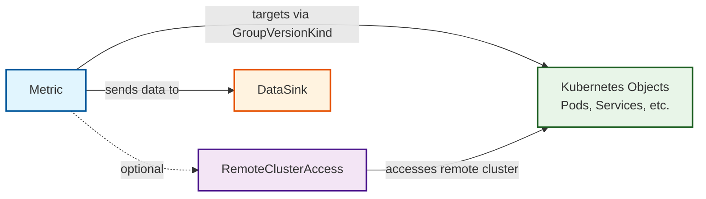
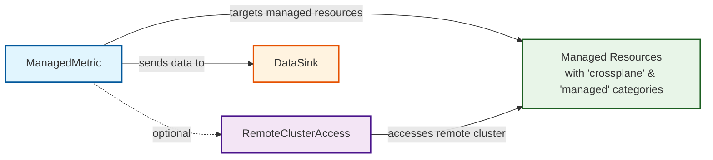
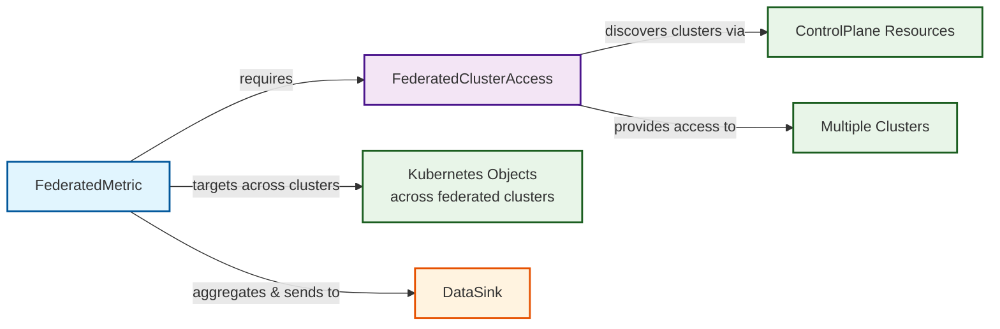
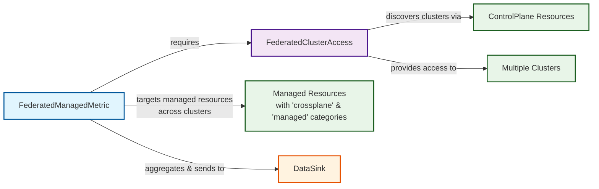

# Architecture Overview

The Metrics Operator provides four main resource types for monitoring Kubernetes objects, each suited for different use cases.

## Resource Flows

### Metric

### ManagedMetric

### FederatedMetric

### FederatedManagedMetric

## Resource Types

| Resource | CRD | Description |
|---|---|---|
| **Metric** | [metrics.openmcp.cloud_metrics.yaml](../cmd/metrics-operator/embedded/crds/metrics.openmcp.cloud_metrics.yaml) | Monitors specific Kubernetes resources in local or remote clusters using GroupVersionKind targeting |
| **ManagedMetric** | [metrics.openmcp.cloud_managedmetrics.yaml](../cmd/metrics-operator/embedded/crds/metrics.openmcp.cloud_managedmetrics.yaml) | Specialized for monitoring Crossplane managed resources (categories: "crossplane" + "managed") |
| **FederatedMetric** | [metrics.openmcp.cloud_federatedmetrics.yaml](../cmd/metrics-operator/embedded/crds/metrics.openmcp.cloud_federatedmetrics.yaml) | Monitors resources across multiple clusters, aggregating data from federated sources |
| **FederatedManagedMetric** | [metrics.openmcp.cloud_federatedmanagedmetrics.yaml](../cmd/metrics-operator/embedded/crds/metrics.openmcp.cloud_federatedmanagedmetrics.yaml) | Monitors Crossplane managed resources across multiple clusters |
| **RemoteClusterAccess** | [metrics.openmcp.cloud_remoteclusteraccesses.yaml](../cmd/metrics-operator/embedded/crds/metrics.openmcp.cloud_remoteclusteraccesses.yaml) | Access configuration for monitoring resources in remote clusters |
| **FederatedClusterAccess** | [metrics.openmcp.cloud_federatedclusteraccesses.yaml](../cmd/metrics-operator/embedded/crds/metrics.openmcp.cloud_federatedclusteraccesses.yaml) | Discovers and provides access to multiple clusters for federated monitoring |
| **DataSink** | [metrics.openmcp.cloud_datasinks.yaml](../cmd/metrics-operator/embedded/crds/metrics.openmcp.cloud_datasinks.yaml) | Defines where metrics data should be sent (Dynatrace, custom OTLP endpoints) |

## Data Flow

All metrics are exported via [OpenTelemetry](https://opentelemetry.io) protocol (OTLP) to the configured DataSink. The operator collects resource counts and custom dimensions at each configured interval, then pushes gauge metrics to the OTLP endpoint.
